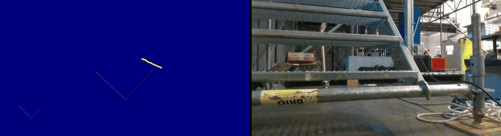
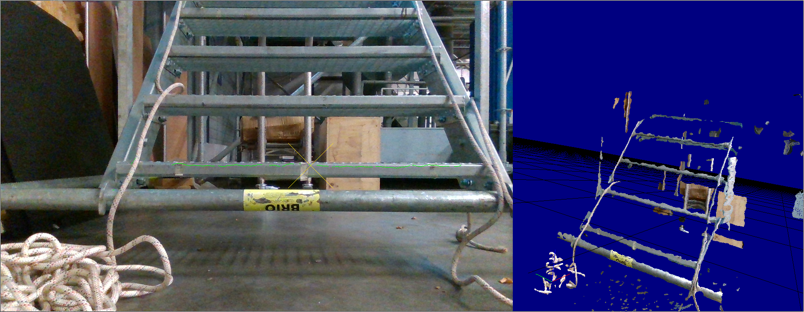

# Industrial Staircase location (IROS2020)

### Abstract
This paper presents an industrial staircase localization algorithm based on RGBD data from a tracked robot. This situation is really challenging as the camera is placed close to the ground. Moreover, RGBD can be really noisy on sparse staircases. Contrary to existing works, our evaluation relies on ground truth data provided by a motion capture system. Our experiments suggest that our algorithm can robustly locate industrial staircase. We also propose a new framework to evaluate stair localization performance from RGBD data. The overall performance allows to safety control a robot to rally the staircase.

Jérémy FOURRE¹, Yohan DUPUIS¹, Vincent VAUCHEY¹, Xavier SAVATIER¹.  
¹[ESIGELEC](http://www.esigelec.fr/) , IRSEEM, Rouen, France, Normandie Univ, UNIROUEN,   

fourre@esigelec.fr
dupuis@esigelec.fr
vauchey@esigelec.fr
savatier@esigelec.fr

Special Thanks to the members of the [SIRD](http://www.esigelec.fr/en/node/113) team : Marc DEHAIS, Anthony DESHAIS, Christophe ALEGRE

### Datasets
Dataset RGBD Camera done by [ESIGELEC](http://www.esigelec.fr/)

Dataset|[Distance IRON 2](https://esigelec-my.sharepoint.com/:u:/g/personal/vauchey_esigelec_fr/EfAxcFk9cNhMlJXKxARsQ1wB4WQnwim8kuPU5h8VrJpkmg?e=hVtwIw)|[Angle IRON 2](https://esigelec-my.sharepoint.com/:u:/g/personal/vauchey_esigelec_fr/EZbpdJKZDBRLiMnnpOpUJoUB3VnpQRvKI1gEMUJwZ_9qfA?e=jdL4i1)
:-: |:-: | :-:
Distance (m)|$$d\in\{0.5,0.6,\cdots,2.0\}$$|1.0
Angle (deg)|0.0|$$a\in\{-40,-30,\cdots,40\}$$

List of sensors and software used :
* D415 trigged on IMU ([intelrealsense](https://www.intelrealsense.com/depth-camera-d435))
* RTMAPS ([Intempora](https://intempora.com/)) Realtime acquisition software (can also be used to replay datasets)
* [VICON](https://www.vicon.com/) positionning system use as reference

Result obtained on industrial staircase with no riser and drilled tread :

